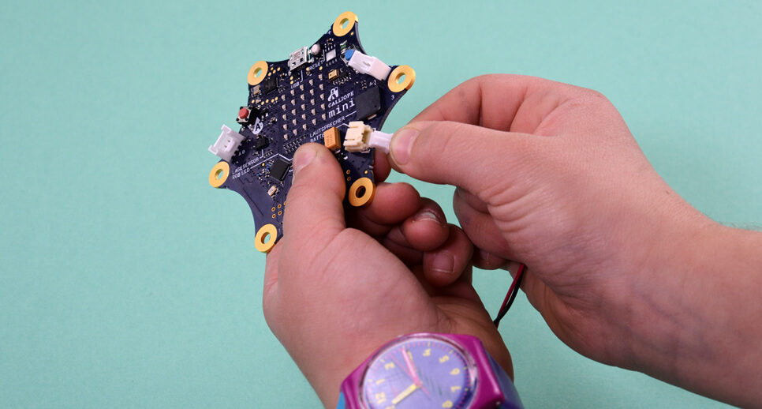

= Wie funktioniert eigentlich ein Computer?
Informatik zum Anfassen an der Grundschule Eichholz
:toc: right
:toc-title: Inhaltsverzeichnis

== Ziel
Computer sind in den meisten Lebensbereichen mittlerweile nicht mehr wegzudenken. Viele Vorgänge des täglichen Lebens wie z.B
Überweisungen, Steuererklärungen, Einkäufe können über das Internet abgewickelt werden. Und auch die Arbeitswelt verändert sich 
durch die fortschreitende Digitalisierung - mit allen Chancen und Risiken. 

Um mit der gestiegenen Komplexität des Alltags und des Berufsleben umgehen zu können, benötigen wir und vor allen Dingen die zukünftigen Generationen eine digitale Kompetenz, die es ermöglicht mit den neuen Medien bewusst umgehen zu können. Grundlage für eben diese Kompetenz ist es, _Computer nicht nur bedienen zu können, sondern Sie zu verstehen._ Dieses Verständnis hilft, nicht in eine Abhängigkeit der Technik zu geraten, sondern Sie (selbst-)bewusst zu benutzen.

Dieses Thema wird aktuell in den Medien diskutiert, siehe <<zeit>> und <<p_daily>>.

Ziel der Initiative ist es, Kindern einen kreativen Zugang zu der Funktionsweise von Computern zu vermitteln. Sie
erlernen Programmierfähigkeiten und damit grundlegende Medienkompetenzen, dringend notwendige Kompetenzen für die Welt
von Heute und Morgen.

== Unterrichtskonzept
Das Fach "Informatik" kann auf verschiedenste Weise in den Unterricht integriert werden. Beispielhaft sollen hier nur 3
Beispiele genannnt werden, die die Vermittlung von Informatik als primäres Ziel haben. Alternativ können Elemente davon
auch in anderen Unterrichtsbereichen verwendet werden - z.B. in Mathematik oder im Sachkundeunterricht.

=== Wie sieht ein Computer von Innen aus?
Die meisten Kinder kommen schon sehr früh mit dem Computer in Kontakt - aber die wenigsten wissen aber wie er eigentlich
funktioniert. 

Unter Anleitung eines Lehrers schrauben die Kinder in dieser Unterichtseinheit einen handelsüblichen Desktopcomputer
auf, es bieten sich hier die vorhanden Geräte im Computerraum an. Die Kindern lernen bereits dort, welche
Sicherheitsvorkehrungen beim Umgang mit elektrischen Geräten getroffen werden müssen - Wissen, das Sie ebenfalls im
Alltag benötigen.

Die Kinder bekommen einen Eindruck aus welchen Komponenten(Prozessor, Festplatte, Speicher etc.) und lernen deren
Aufgabe.

Ziel der Unterrichtseinheit:

* Sicherheitsweinsung im Umgang mit elektrischen Geräten
* Erläuterung des Aufbaus und Funktionsweise des Computers

=== Das programmierbare Klassenzimmer
Algorithmen spielen beim Verständnis von Computern eine Große Rolle. Algorithmen sind eindeutige Handlungsvorschriften
für die Lösung eines Problems. Algorithmen sind etwas "virtuelles" und damit zunnächst für Kinder nicht direkt greifbar.
Deshalb soll in dieser Einheit das Klassenzimmer programiert werden - ganz ohne Computer.

Bezogen auf die Bewegung eines Menschen, wäre ein Algorithmus beispielsweise:

1. gehe geradeaus
2. wenn eine Mauer im Weg ist,
3. um 90° drehen

In einem kleinen Spiel werden die Kinder verschiedene Aufgaben mit Tischen durchführen.

=== Kreatives Programmieren mit dem Calliope Mini

In dieser Einheit können Kinder mit dem Kleinstcomputer Calliope Mini<<calliope>> kreativ eigene Projekte entwickeln.
Der Computer wird von der gemeinnützigen Gesellschaft Calliope entwickelt und aktuell in ausgewählten Grundschulen in
Deutschland getestet. In den nächsten Monaten wird der dann im Saarland flächendeckend verteilt. Das
Vorgängermodell. Der Vorgänger des Calliope, der BBC Micro Bit <<microbit>>  wird bereits seit einigen Jahren in
Großbritannien an der Grundschule für den Unterricht genutzt.

[quote, Calliope, Mission Statement]
Unsere Mission ist es, jedem Schulkind in Deutschland ab der 3. Klasse einen spielerischen Zugang zur digitalen Welt zu ermöglichen.

[quote, Calliope, Mission Statement]
Davon versprechen wir uns besser ausgebildete Schulabgänger/innen, aber auch kritischere und souveräne Nutzer/innen der
neuen Technologien, die sowohl Begeisterung für die Möglichkeiten als auch ein Gefühl für die Gefahren vermittelt
bekommen haben.

Der Calliope Mini ist speziell für den Einsatz an Grundschulen konzipiert und beinhaltet alles, was die Entwicklung von
kreativen Projekten benötigt:

* Lämpchen
* Knöpfe
* Kompass
* Beschleunigungssensor
* Temperatur-, und Hellikgeitssensor
* USB und Bluetooth
* Lautsprecher und Mikrofon
* Motoranschluss

Die Calliope Organisation wird vom Schulbuchverlag Cornelsen unterstützt, der Unterrichtsmaterialien <<cornelsen>> für Lehrer
angefertigt hat.

==== Mögliche Projekte
* Würfel
* 1x1 Rechentrainer
* Alarmanlage
* Pflanzenbewässerung
* Straßenbeleuchtung
 
==== Kosten
Über die Crowdfunding Plattform startnext konnten 25(ein Klassensatz) Calliope Rechner für 750,- bestellt werden. Diese werden
voraussichtlich im April 2017 zugestellt.

== Referenzen
[bibliography]
- [[zeit]] http://www.zeit.de/digital/internet/2016-03/bildung-schulfach-digitalkunde-erste-klasse
- [[p_daily]] https://perspective-daily.de/article/158/Nt8OIy7m
- [[calliope]] https://calliope.cc
- [[microbit]] http://microbit.org/
- [[cornelsen]] http://calliope.cc/lehrer-informationen
